
<h1 align="center">基于Spring Boot的在线考试系统</h1>

## 简介
在线考试系统：角色分为管理员、学生、教师；支持个人信息管理、课程和题库管理、考试安排与记录、通知发布、实时答题反馈，界面简洁操作便捷，提升教育机构的考试效率和用户体验。    --计算机毕业设计源码；毕设源码；java毕业设计源码

## 联系方式

<h3 align="center">获取完整代码与数据库文件 + 微信：deepguan QQ: 86050149 QQ群: 783742310</h3>

<h3 align="center">可帮忙远程部署 包运行成功！提供远程部署、修改代码、设计文档指导、代码讲解等服务！</h3>

## 功能介绍（完整见运行截图）
管理员： 基本功能包括登录、注册和退出，提供网站首页主导航栏及个人中心功能，支持学生管理、教师管理和课程分类管理，同时具备公告发布、题库管理和在线考试管理操作，可以管理轮播图和题目列表，提供详尽的课程和考试信息管理功能，确保系统流畅运行与内容更新。

教师： 能够注册、登录和退出，进入后可以访问课程信息管理模块，创建并管理课程内容，能够查看和修改已发布的课程细节，参与课程分类管理及发布通知公告，支持题库管理和在线考试创建，负责设置试题与评分标准，确保考试的公平性与有效性。

学生： 可进行用户注册、登录和身份选择，登录后可访问个人中心，更新个人信息如账号、姓名、密码等，查看和管理考试记录及错题本，能够参与在线考试，访问课程信息，完成试题解答，查看考试成绩与反馈，提供个人学习进度跟踪。

访客用户： 可以浏览系统首页，查看主导航栏的信息内容，可访问通知公告与课程信息，了解在线考试系统基本结构，无需登录即可访问公开资讯，提供系统概览以吸引潜在用户注册及参与，促进系统的普及与利用。

## 运行截图
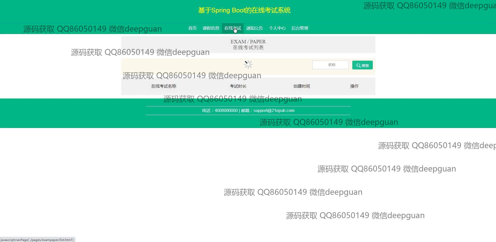

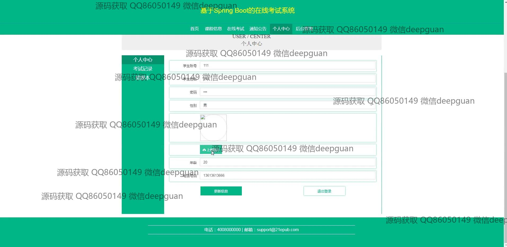

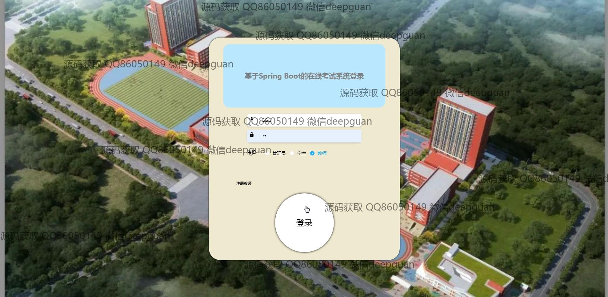
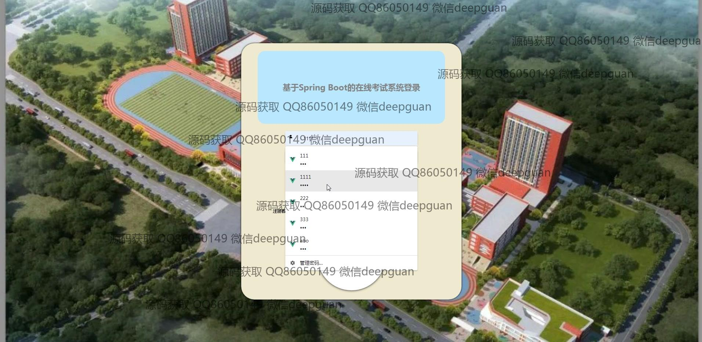
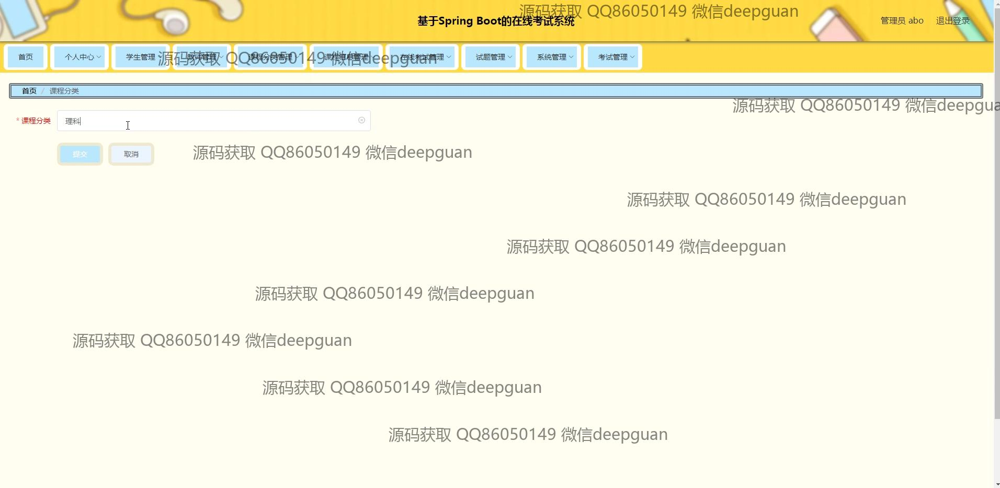
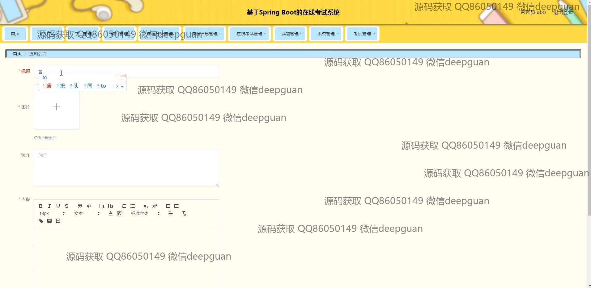
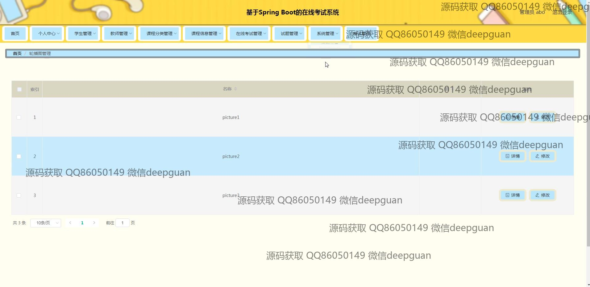
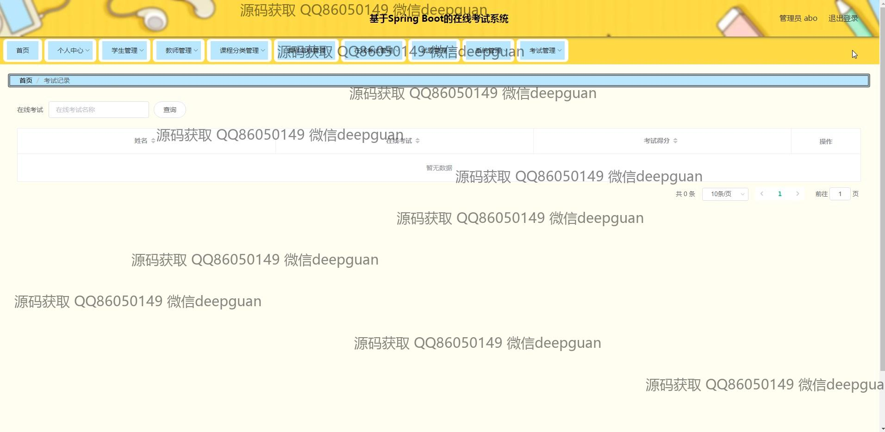
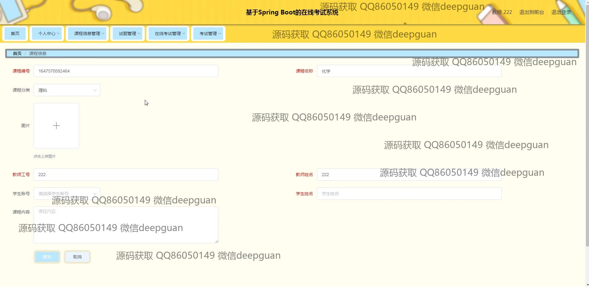
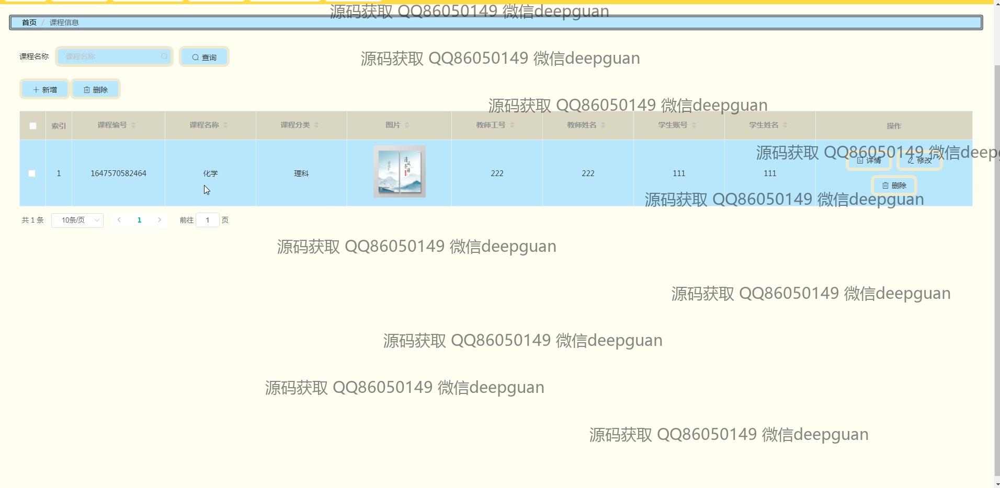
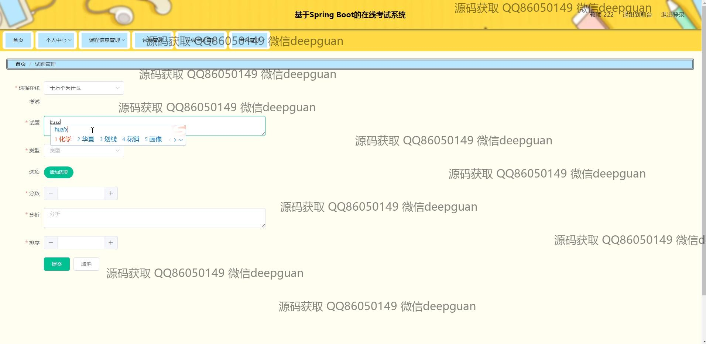
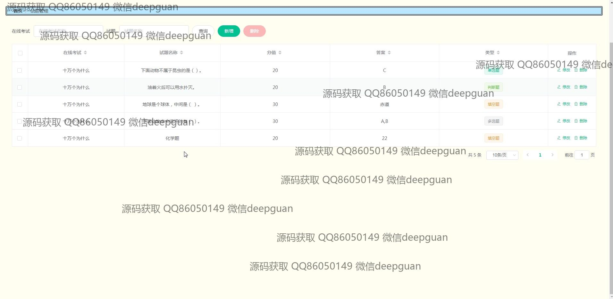

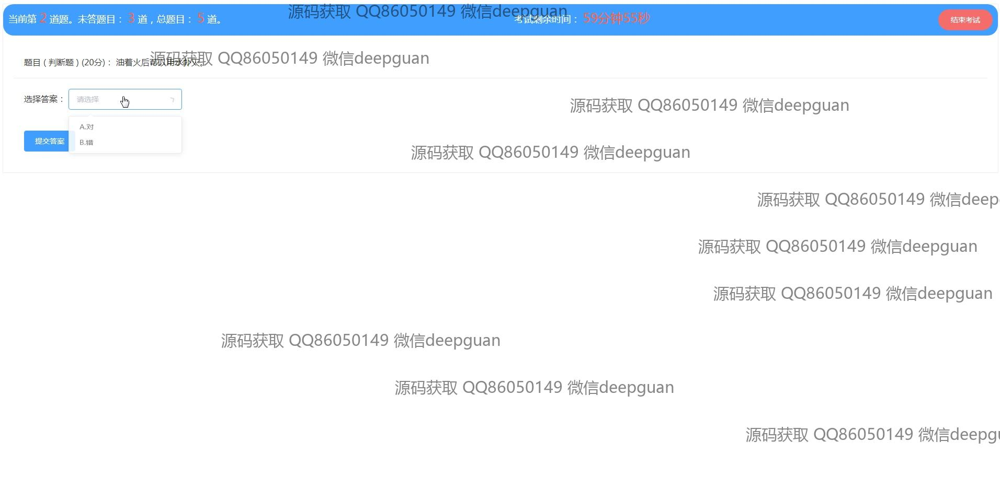
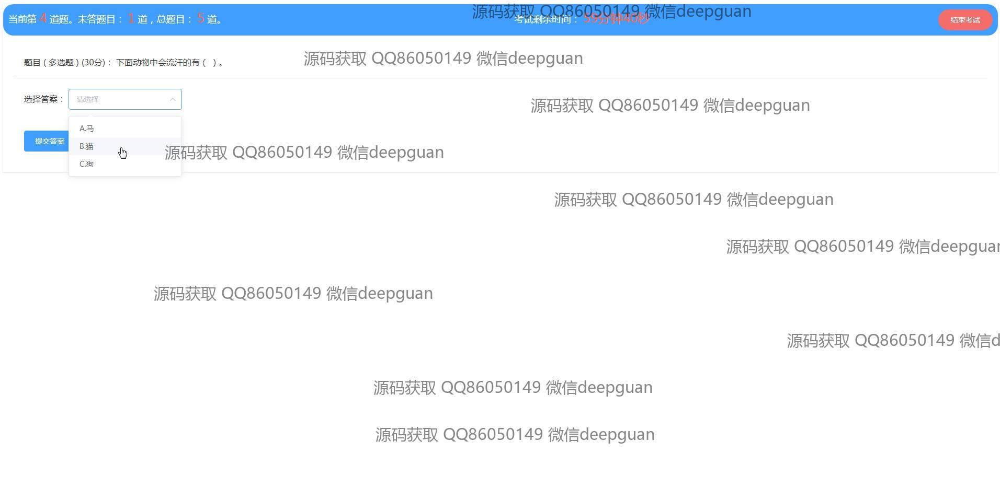
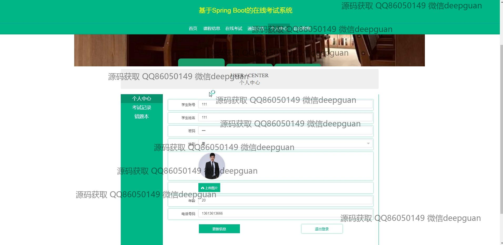

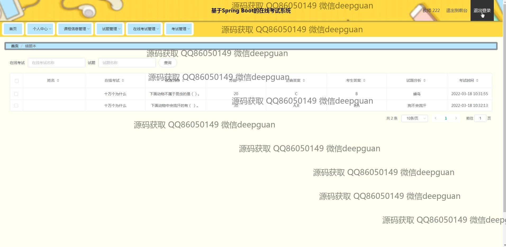

本代码来源于网络,仅供学习参考使用!

